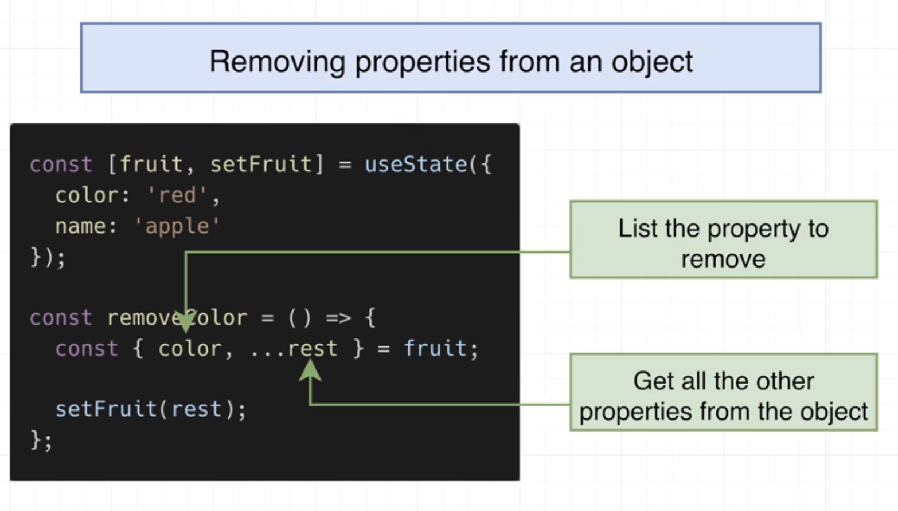

1. React doesn't print or render objects in curly braces

   ```react
   function App() {
    const config = { color: 'red' }
   
     return (
       <div>
         {config} 
       </div>
     ) 
     // react will throw error for displaying objects inside curly braces
   }
   
   ```

2. When passing props, use double quotes to wrap Strings and curly braces to wrap Numbers, Arrays, Objects and Variables.

   ```react
   function App() {
    	return (
       <input type="number" min={5}/>
     ) 
   }
   ```

3. Five rules:

   - All prop names follow camelCase ('placeholder')
   - Number attributes use curly braces
   - Boolean true can be omitted, false needs to be specified
   - class is written as className
   - in-line styles are provided as objects, if the style name contains any dashes, remove them and capitalize the next word

4. Export/Import

   ```react
   function App() {
     return <h1>Hi</h1>
   }
   
   export default App;
   
   const message1 = 'hi';
   export { message };
   
   // or
   
   export default function App2() {
     return <h1>Hello</h1>
   }
   
   export const message2 = 'hello';
   ```

   ```react
   import MyApp from './App';
   
   // default exports can be renamed in the importing file
   
   import App, {message} from './App';
   
   // named exports can't be renamed
   ```

5. Images that are smaller than 9.7kb will be included in-line instead of be treated as a sperate file

6. Sibling components in React cannot directly communicate without the help from a third party library

7. If you wrap an input element inside a form element, whenever you enter the enter key, it will submit the result and refresh the page, but don't forget to prevent the default behavior of onSubmit event of the form, because it will automatically collect form values and submit requests to a different urls

   ```react
   <form>
     <input></input>
   </form>
   ```

8. Common error: 

   > A component is changing an uncontrolled input to be controlled.

   happens when you update code inside the browser without refreshing the page

9. Using index as list keys in React is a fallback, you will get bugs since each time when you change the original order of the list, the indexes change as well, so you cannot guarantee the uniqueness of the keys

10. When you update state like an array state, if you modify the existing array instead of making a copy of it, React is "smart" enough to detect that you are manipulating the same array based on its reference thus no state update is triggered.

11. slice cheatsheet

    

12. Add element at the middle of an array

    

13. Modify an element based on a property

    

    

14. Adding properties to an object

    

15. Removing properties from an object

    

16. When does the callback function get called when useEffect is used?

    

17. context

    

    

    

19. ```react
    import { createContext } from 'react';
    
    const BooksContext = createContext();
    
    export default BooksContext;
    
    <BooksContext.Provider value={5}>
      <App /> // now App and its children will get access to the value 5
    </BooksContext.Provider>
    ```

20. Application State vs Component State

    

21. useEffect

    

22. How to start a React project without using creat-react-app

    ```react
    // index.js
    import React from 'react';
    import ReactDOM from 'react-dom/client';
    import App from './App';
    
    const el = document.getElementById('root');
    const root = ReactDOM.createRoot(el);
    
    root.render(<App />);
    ```

    ```react
    // App.jsx
    function App() {
      return <div>App</div>
    }
    
    export default App;
    ```

23. If you put any thing in between your custom component tags, that thing will be passed down as the children prop to the child component, it could be text or even another component

    

24. Validate props using 'prop-types'

    

25. Build className with classnames, you can use curly braces for conditional selection, later property will overwrite previous ones

    

26. Using dot spreader to pass eventListeners

    

    

27. rest object can also be used for passing classnames

    

    